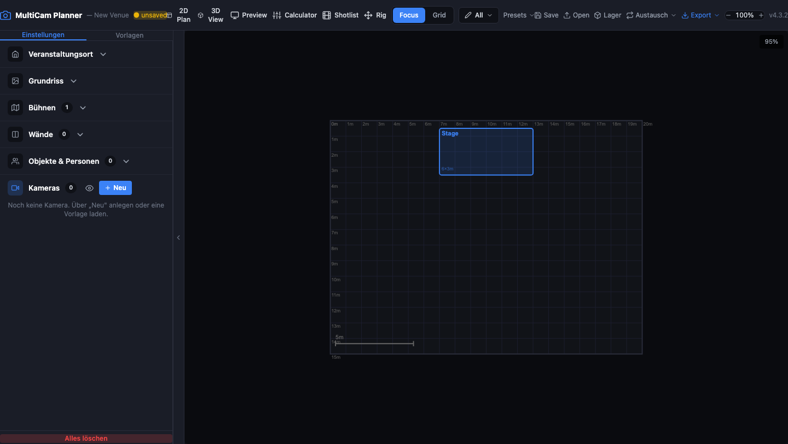

# 🎥 MultiCam Planner

A fast, focused broadcast camera & lens planning tool for multicam setups. Calculate FOV/DoF, plan camera positions in 2D & 3D, and preview live camera views. Available as a web app and Windows desktop application.

[](LICENSE)



---

## The web page

Every push to the default branch builds this repo's page from
`.github/workflows/pages.yml` and publishes it:

**https://larszu.github.io/multicam-planner/**

The workflow **asks the Pages API before it configures anything.** With no
Pages site it still builds — that is a real check — and skips only the
publishing step, with a warning and the one missing step in the run summary.
A run that must stay red for a click nobody made teaches people to ignore red.

Measured 2026-09-09: **published** — the `deploy` job ran and succeeded.

---
## ✨ Philosophy

MultiCam Planner is designed for quick, intuitive camera planning with essential features for real-world broadcast productions. Its streamlined workflow and simple interface make it perfect for fast setups and clear projects—without the complexity and feature overload of traditional CAD or architecture applications.

---

## 🚀 Features

### 📷 Camera & Lens Database
- 54+ broadcast cameras from 10 major brands (Sony, Canon, Panasonic, Blackmagic, ARRI, RED, Grass Valley, Hitachi, Marshall)
- 163+ lenses (Fujinon, Canon, Sony, Sigma, Tamron, Tokina, PTZ integrated)
- 11+ mounts: B4, EF, E, PL, MFT, RF, FZ, L, M12, integrated, universal
- Adapter system: automatic adapter detection with T-stop light loss, sensor crop info, Speed Booster support (e.g., EF→MFT)
- Custom lens support: create and save your own lenses
- Favorites: star cameras and lenses for quick access

### 🗺 2D Venue Planner
- Top-down drag & drop camera placement with real-time FOV cones
- Zoom, pan, snap-to-grid, background floor plan import (image & PDF)
- Two-point calibration tool for scaling imported floor plans
- Draw walls with 45° shift-snapping
- Place stage objects (person, guitarist, drums, keys, mic stand, custom)

### ⚡ 3D Venue View
- Interactive 3D venue visualization with FOV pyramids
- FPS-style controls (WASD + mouse look, Space/Shift up/down, Ctrl sprint)
- Drag cameras in space, visualize stage meshes & venue boundaries
- Background floor plan projection, floor grid with metric labels

### 👀 Camera Preview
- Live viewfinder simulation with accurate perspective
- Ground grid, sky/horizon, stage outlines, reference silhouettes
- Overlays: rule of thirds, safe areas, crosshair, data HUD
- Pan/tilt using mouse drag

### 📐 FOV & DoF Calculator
- 9 sensor sizes (Full Frame, Super 35, APS-C, MFT, 1", 2/3", 1/2", 1/3", 1/2.3")
- Controls for focal length, aperture, distance, extenders
- Outputs: horizontal/vertical/diagonal FOV, image dimensions at distance, 35mm equivalent, DoF near/far/total, hyperfocal distance, person height in frame

### 💾 Project & Layout
- Save/load projects as JSON with version tracking and unsaved changes detection
- Dockable panel system (FlexLayout): drag, split, tab, resize
- Layout modes: Focus (single tab) and Grid (2×2)
- Customizable layout presets (save/load/delete)
- Venue templates: sport, concert, church, conference, custom (save your own)
- Export: Combined 1920px PNG containing 2D plan, 3D view, camera preview, and technical data sheet

### 🖥 Desktop App
- Windows installer (NSIS) and portable build with Electron
- Native window controls, external links open in system browser

---

## 🛠 Tech Stack

| Technology             | Version    |
|------------------------|-----------|
| React                  | 18.3      |
| TypeScript             | 5.7       |
| Vite                   | 6.0       |
| Zustand                | 5.0       |
| React-Konva            | 18.2      |
| Three.js / React Three Fiber | 0.170 / 8.17 |
| Tailwind CSS           | 3.4       |
| FlexLayout-React       | 0.8       |
| Electron               | 41.2      |
| electron-builder       | 25.1      |

**Source language:** `en`. When this planner gets its translation layer, the
English string in `t('ns.key', 'English source')` is the source text — the one
that appears when a key has no translation — and German lives in an override
dictionary. That is how the copy inside `av-planner-suite` is already built
(482 German override keys in 14 files); turning the direction around would mean
touching ~500 strings again for no visible gain.

This is a property of *this repository*, decided on 2026-09-08 (E-17/E-20):
`sony-camera-bridge` is English-source as well, while `cable-planner` and
`light-planner` are German-source. Upstream here still has no i18n at all and
a hard-coded German UI — that gap is tracked as B-25. `npm run lang:check`
holds the declaration today and starts measuring by itself as soon as the first
fallback string appears. The machine-readable copy sits in `package.json` under
`avplan.sourceLanguage`.

---

## 🚦 Getting Started

### Web App

```bash
npm install
npm run dev
# Open http://localhost:4182
```

### Desktop App

```bash
# Run in dev mode
npm run desktop

# Build Windows installer & portable
npm run dist:win

# Build macOS DMG + ZIP (x64 + arm64, must run on macOS)
npm run dist:mac
```

A GitHub Actions workflow (`.github/workflows/release-build.yml`) automatically
builds Windows and macOS artifacts whenever a release is published and attaches
the binaries (NSIS installer, portable .exe, DMG, ZIP) directly to the release
page. It can also be triggered manually via the Actions tab for testing.

---

## 📜 Useful Scripts

| Script             | Description                                       |
|--------------------|---------------------------------------------------|
| npm run dev        | Start local Vite dev server                       |
| npm run build      | TypeScript check + production build               |
| npm run desktop    | Launch Electron in dev mode                       |
| npm run dist:win   | Build Windows installer & portable                |
| npm run dist:mac   | Build macOS DMG + ZIP (x64 + arm64, host = macOS) |
| npm run preview    | Preview production build                          |
| npm run lint       | Run ESLint linter                                 |

---

## 📚 Documentation

- [`docs/MERGE_INTO_CABLE_PLANNER.md`](docs/MERGE_INTO_CABLE_PLANNER.md) —
  **superseded, kept as analysis.** It describes folding MulticamPlanner into
  `cable-planner`; the suite went the other way (ADR-006: crowded areas move
  *out* into their own repos and the shell integrates them). Its list of
  dependency-free modules and its risk section still hold.
- [`docs/venue-suite-architecture.md`](docs/venue-suite-architecture.md) —
  extends that guide with `light-planner` and a shared venue data model. The
  shared-model part is built (`@avplan/*`); the merge part is superseded too.

`npm run docs:reachable` fails the build if a document under `docs/` is not
reachable by links from an entry page. Both were orphaned until 2026-09-04.

---

## ❤️ Support / Donate

If MulticamPlanner saves you time on your next show, consider buying me a coffee:

<p>
  <a href="https://paypal.me/larszumpe">
    
  </a>
</p>

Donations are completely optional — the app stays free to use. It is proprietary software, not open source. 🙌

---

## 📝 License

Proprietär — © 2026 Lars Zumpe, alle Rechte vorbehalten. Nutzung der veröffentlichten Builds ist kostenlos; Weiterverbreitung und abgeleitete Werke sind es nicht. Siehe [LICENSE](LICENSE).

---

> **Feedback, issues, feature requests, and contributions are welcome!**  
> Demo & contact: [larszu.github.io](https://larszu.github.io)
